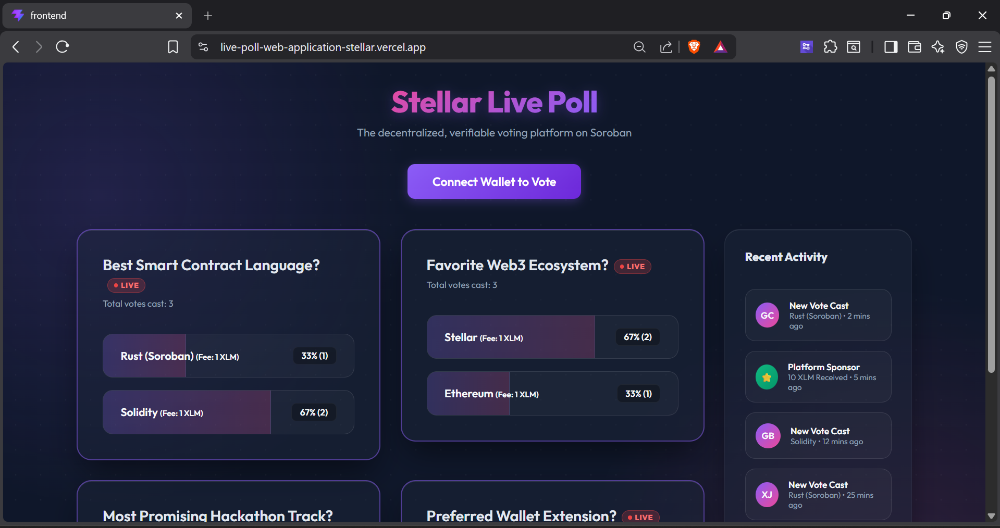
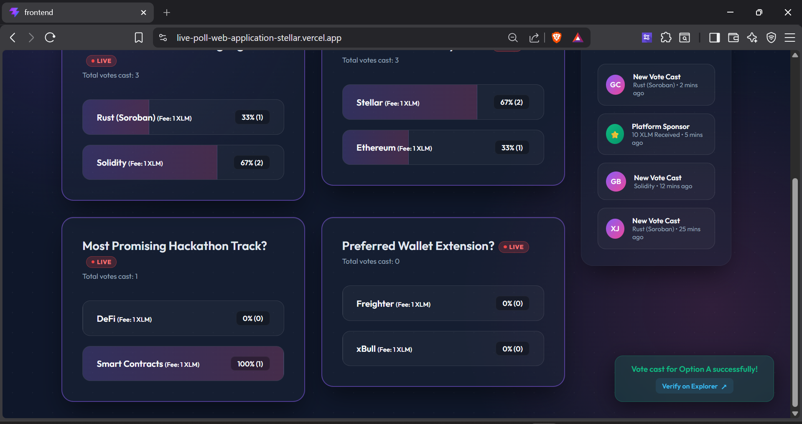
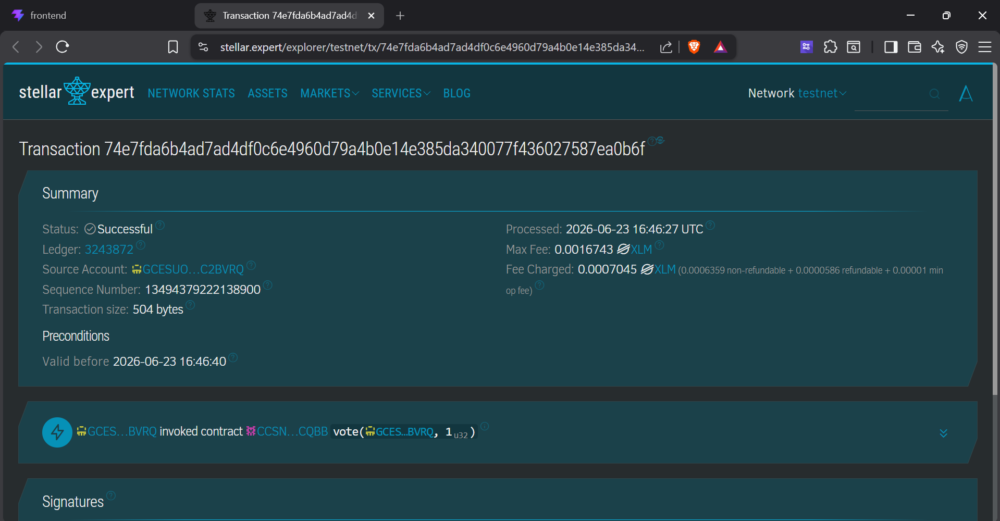

# Stellar Live Poll - Level 2

A multi-wallet decentralized application that allows users to cast votes on a smart contract deployed to the Stellar Testnet. This project demonstrates wallet integration, real-time sync, and smart contract interaction.

## Features
- **Multi-Wallet Support:** Users can connect using their preferred wallet (Freighter, Albedo, xBull, etc.) through `@creit.tech/stellar-wallets-kit`.
- **Stellar Smart Contract (Soroban):** Written in Rust and deployed to the Testnet. Ensures only one vote per wallet and tracks live totals securely on-chain.
- **Real-Time Data Sync:** The frontend fetches and synchronizes vote tallies from the chain automatically.
- **Transaction Status UI:** Distinct banners to communicate the state of transactions: `Pending`, `Success`, or `Failed`.
- **Robust Error Handling:** Specifically handles errors such as missing extensions, user rejection, and insufficient balance.

## Setup Instructions

### Prerequisites
- Node.js (v18+)
- A Stellar Testnet wallet (e.g., Freighter extension installed)

### 1. Install Dependencies
```bash
cd frontend
npm install
```

### 2. Run Locally
```bash
npm run dev
```

Visit `http://localhost:5173` to view the live poll.

## Submission Details

### Live Demo
**[Live Demo on Vercel](https://live-poll-web-application-stellar.vercel.app/)**

### Deployed Contract Addresses (Stellar Testnet)
This application uses four distinct Soroban smart contracts for the four polls:
1. **Best Smart Contract Language:** `CBUG37SP3SNYGOS65YSKYY236XHNFN3IJEKRGGLGPSQKXPIU7DRIUARJ`
2. **Favorite Web3 Ecosystem:** `CDWCRN7KGQ5NV55I6K323IMYV4W7ONIKP3NAPC23DW5JSVRJNCOQPDIM`
3. **Most Anticipated Stellar Feature:** `CARPEGCVTFWEVTLFGYCSZ2AVPWEUYRSGHYVEQ2MBBJRIFSAT7NOU2EIB`
4. **Favorite Wallet:** `CCSN7R64NVN2RVLFGLYQBAYNF5BZZ6MZH2KBJNBOD4SNYE5ZG2Q4CQBB`

### Transaction Hash (Contract Call)
- **Example Vote Cast (Poll 2):** `0b4fae995ddc1de2acabcb6640e93993dda6fd1c288cd02ad66665d37bb18271`
  - *Verify on [Stellar Expert Testnet](https://stellar.expert/explorer/testnet/tx/0b4fae995ddc1de2acabcb6640e93993dda6fd1c288cd02ad66665d37bb18271)*

## Error Handling Demonstrated
1. **Wallet Not Found:** If no wallet extensions are installed, attempting to connect will throw a user-friendly error instructing them to install a wallet.
2. **User Rejected:** If the user declines the signature request in their wallet, a specific error UI is displayed.
3. **Insufficient Balance / Failed Execution:** Attempting to cast a vote without enough XLM to pay the fee will catch the network error and tell the user they need more testnet funds. It also handles sequence number race conditions gracefully.

## Screenshots

### Dashboard


### Multiple Wallets Available


### Step 1: Sign In


### Step 2: Sign In Transaction


### Wallet Connected and Balance


### Submitting on Network


### Success Pop-up


### List of Cast Votes


### Verified

